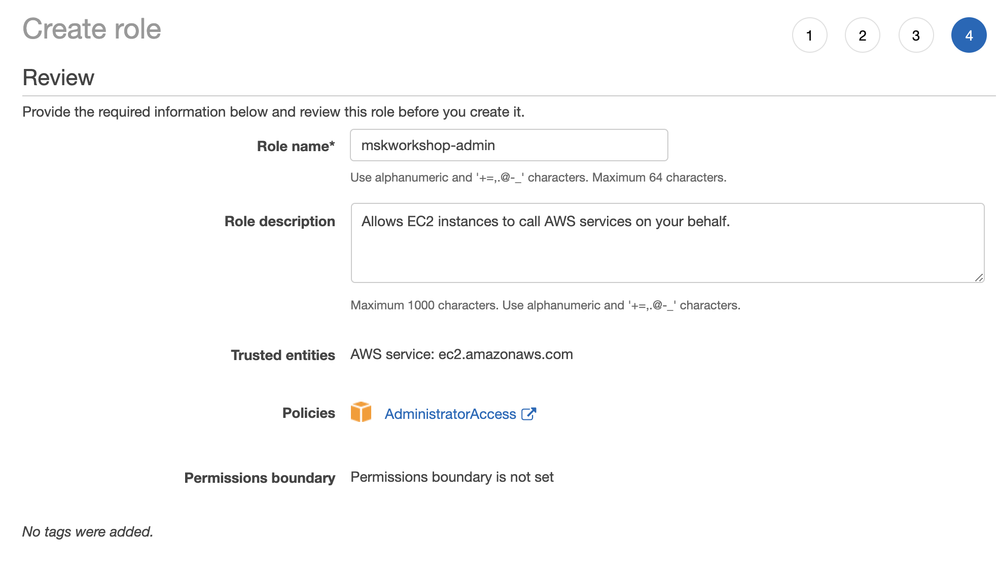

# Step A

> [!TIP]
> This is a tip to remind users about something. This is a tip to remind users about something

## 1. This is the first section

* Follow [this deep link to create an IAM role with Administrator access](https://console.aws.amazon.com/iam/home#/roles$new?step=review&commonUseCase=EC2%2BEC2&selectedUseCase=EC2&policies=arn:aws:iam::aws:policy%2FAdministratorAccess)
* Confirm that AWS service and EC2 are selected, then click Next to view permissions.
* Confirm that AdministratorAccess is checked, then click Next to Tags.
* Just click Next to review.
* Enter mskworkshop-admin for the Name, and select Create Role

