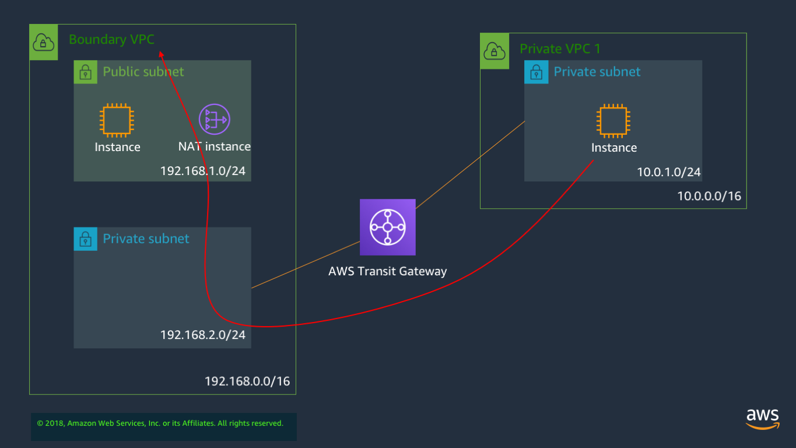

## Overview of architecture

In lab 1 we will be deploying a transit gateway, and linking two VPCs together, as shown in the diagram below:

## Preparing the environment

### 1. Create a keypair in eu-west-1, account 1

You won't need the keypair unless you want to ssh directly into the instance, but you cannot launch the instance without a keypair. In these labs, we will mostly be using SSM Session Manager to access instances.

Unless you already have used the name, give this keypair the name `KeyPair` to match the entry in the CloudFormation template.

### 2. Launch the CloudFormation template

Launch template `Lab1_Region1Acct1.yaml` and use the default entries. If you have not named your keypair `KeyPair` then change this parameter so it matches the name you provided.

To download the cloudformation template for setting up lab 1, [click here](https://d2x18vu72ugj64.cloudfront.net/Lab1_Region1Acct1.yaml).

To download the template from workdocs [click here.](https://amazon.awsapps.com/workdocs/index.html#/document/f1a82d39db4589c2edef151497808caafedf632cdd2e67983e6bd3f60ede19e8)

The creation of the resources will take around 5 minutes. 

### 3. Checking the launched stack

Once complete, check the following:

* Your stack has created 2 VPCs, 3 subnets, 5 instances and an IAM role for SSM, which will include the characters `ssm`.

* In Systems Manager -> Managed Instances, you can see the 5 instances that were created, listed as being managed.

* Connect into each one via Systems Manager -> Session Manager, and try and ping all the others, as well as checking Internet access via the NAT instance. To do this, issue the command `curl amazon.co.uk` in Linux, which should respond with an html header. Use the provided [testing matrix](https://www.networking-workshop.com/#/testingmatrix) to record your results. 

All instances in the `192.168.0.0/16` range should be able to ping one another, but the instance in the `10.0.1.0/24` range should be unreachable.

Also, the `curl` command should work from all instances except `192.168.1.100` and `10.0.1.100`

> [DANGER]
> Be aware that normal architecture should use a NAT gateway rather than a NAT instance. However, we want to do some traffic mirroring on the NAT instance in a later lab, and traffic mirroring currently requires an instance with a Nitro card to act as source. 

> We have put an instance in the public subnet purely to act as a testing point (something you can ping from). This is not intended to be a web server, or have direct Internet access. That is why we have no public IP on it. Normally, you would either put a public IP on the instance, or better, for inbound traffic, use a load balancer pointing to an instance in a private subnet.

---

## Building the Transit Gateway

### 1. Create the transit gateway

* Give it the AS number `65000`
* **Enable** DNS support and auto-accept shared connections
* **Disable** default association and propagation

### 2. Create transit gateway attachments

* Create attachments in both the boundary and private VPCs
* Make sure the attachment in the boundary VPC is placed in the **private** subnet, with IP range `192.168.2.0/24`

### 3. Create and populate the transit gateway route table

* Create a main route table, with a name like `MeshRouteTable`
* Associate both attachments with that route table
* Either propagate both attachments to that route table, or enter routes in the table for the appropriate VPC CIDR ranges
* Add a **default route** to the transit gateway route table, pointing to the boundary VPC attachment

> [!TIP]
> A default route is a route entry that tells a routing table 'if you don't have a specific match for this packet, then send it on this way'. The standard way of expressing a default route in IP is to set the route to 0.0.0.0/0, and point this towards the next hop where you want the packet to go.

> 0.0.0.0/0 means match with any possible address.

> It is important to remember that a routing table will always match to the most specific route first. The order of the routes in a routing table is usually just in numerical sequence, and the routing decision is based on which route has the best match. This does mean that when routing tables get quite large, a lot of checking has to be done, since every entry has to be validated, at least the first time a packet is routed.

### 4. Update VPC route tables

* Add a **default route** to the Private VPC route table, pointing to the transit gateway
* Add a route to the boundary VPC **public** route table, pointing to the transit gateway for the CIDR range `10.0.0.0/8`. If you want to use the more explicit `10.0.0.0/16` route, you can, but it will mean adding an additional route in a later Lab.

### 5. Test everything

Use the same [testing matrix](https://www.networking-workshop.com/#/testingmatrix) as before, and log into each instance using Session Manager, and see what can ping to what, and which instances are able to reach the internet.

If the lab is working correctly, then everything should be able to ping everything else, and all instances should be able to connect to the Internet, with the exception of `192.168.1.100`.

## What if I can't get lab 1 working?

If you have tried to create the Transit Gateway, and are just not able to get the lab working successfully, then the last option is to delete all the implementation you have done (eg, Transit Gateway, attachments, and CloudFormation stack) and then run a single CloudFormation template which will create the entire lab, including all Transit Gateway components.

This is available as a template called `Lab1Complete_withTGW.yaml`, and only needs that you have created a keypair in order to run successfully. You can download the CloudFormation template for deploying a complete lab 1, including the Transit Gateway [here](https://d2x18vu72ugj64.cloudfront.net/Lab1Complete_withTGW.yaml) .

To download the template from WorkDocs [click here](https://amazon.awsapps.com/workdocs/index.html#/document/e694199480f4b861a6b1d6c3cb058444daed513a89cde170c081c29ab3425bea) .

