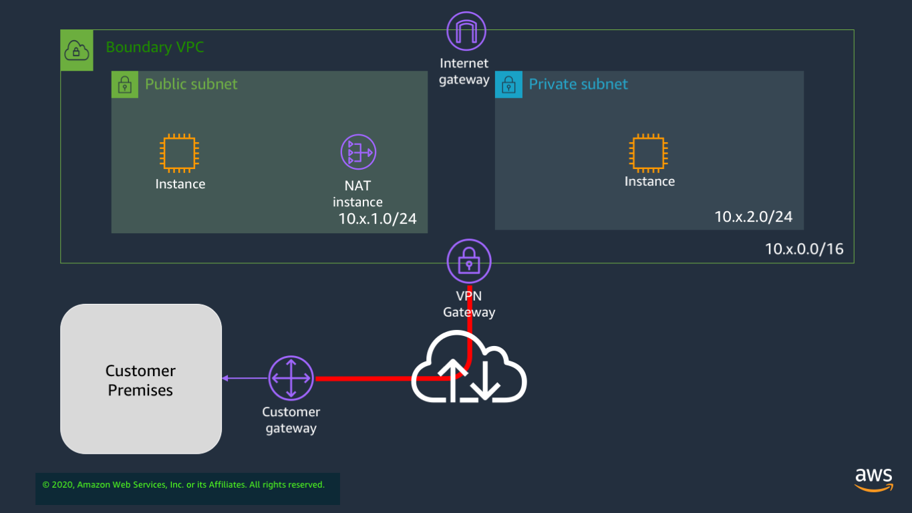

## Overview of architecture

In lab 3 we will be taking the private VPC that we created in lab 2, and adding a virtual private gateway to it so that we can VPN tunnel to an 'on-premise' server, as shown in the diagram below:

In reality, the 'on-premise server' will either be a Linux instance running in a VPC in another account, or a Cisco CSR that you set up in another VPC. In either case, this is just to simulate a router that can support a VPN tunnel.

In this case, we will use static routes to connect to the VPN termination device and ping the far-end server. In a later lab, we will explore doing that with BGP instead.

## Preparing the environment

