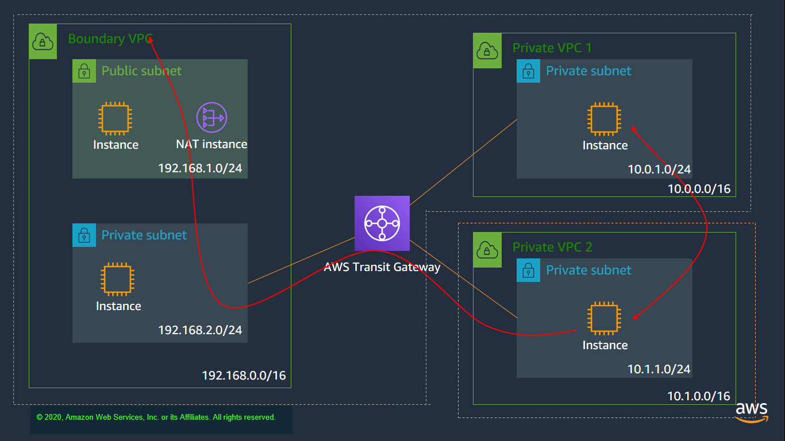

## Overview of architecture

In this lab we look at mirroring traffic that is coming in/out of the NAT instance, so that we can emulate packet tracing of all packets using the NAT function to get out to the internet.

>[!TIP]
>Note that you are now going to be working  back in the first account in **eu-west-1**. You can do all testing from instances within that region and account. We are testing traffic mirroring in this lab, and do not really need to worry about other VPCs or regions. All testing can be done with just the instances in the `192.168.0.0/16` boundary VPC

---

## Preparing the environment

As long as lab 1 was working successfully for you, then there is no preparation for lab 5. If you are running into problems and have broken your lab along the way, then you can deploy the `Lab1Complete_withTGW.yaml` template as a new VPC, and carry out all the testing in that VPC.

---

## Setting up traffic mirroring

### 1. Creating the mirror target

One of the instances created has two interfaces, with the first interface addressed 192.168.2.111. Find this instance, and find the ENI of the second interface. This can be seen in EC2 -> Network Interfaces

Then, within VPC -> Traffic Mirroring, set this interface up as a mirror target. 

We are separating the two interfaces out on the mirror target instance so that we are not confused between traffic arriving on the mirror target (interface 2) and traffic between the interface and SSM for remote access (interface 1)

### 2. Creating the mirror filter

In order to capture traffic, we need to define a filter so that not all traffic is mirrored. Whilst it is possible to mirror all traffic, for our purposes, we are only trying to see what `http` traffic is sent to and from the NAT instance.

To do this, the filter needs to be configured so that inbound traffic (to the NAT instance) has a destination port of `80` and outbound traffic (returning to the private instance) has a source port of `80`. 

We don't try and view outbound traffic with destination port `80` as this would just be the request coming in to the NAT instance, being forwarded on to the Internet. The same is true of inbound traffic with a source port of `80`.

### 3. Setting up the mirror session

Once the target instance and mirror filter are created, then the mirror session can be created as follows:

* Source instance is the NAT instance interface

* Target is the mirror target set up in step 1 above

* Session ID is 1 (when running multiple mirror sessions, each one has to have a unique ID)

* VNI is a VXLAN label (similar to a VLAN tag) and can be set to 1111 (we will need this later)

This completes the mirror session and now mirrors all `http` traffic from the NAT instance to the mirror instance.

---

## Testing the traffic mirroring

It is now possible to test the traffic mirroring, by logging in to two instances. One will be the traffic mirror instance, to view the mirrored traffic, and the other is the private NAT instance (`192.168.2.100`) to generate traffic.

Initially, we will just check the mirror is working, and then we can improve the way we view the data.

### 1. Checking the mirroring is working

* Start an SSM session to both instances (`192.168.2.100` and `192.168.2.111`)
* view the traffic coming in on the second interface of the traffic mirror instance. This can be done using the command:

        sudo tcpdump -nni eth1

    This outputs to screen a list of all packets being received or transmitted on the second interface. There should be a mix of traffic, related to general network chatter (dns resolution, tcp session updates for SSM etc) and the mirror packets (VXLAN on port `4789`)

* Generate traffic, initially by pinging `192.168.1.200` from `192.168.2.100`. This shouldn't actually show any traffic on the traffic mirror, since the mirror filter is set to only monitor `http` traffic.

* Now generate `http` traffic by using the command 

        curl amazon.co.uk
    
    from the test instance (`192.168.2.100`). At this point, you should see significant traffic packets being shown on the mirror target instance, marked with destination port `4789` and potentially tagged as `VXLAN` as Linux is taking its best guess as to the type of traffic.

### 2. Refining the traffic capture

Testing in step 1 above proves that the traffic capture is working, but it would be better if we could separate out the incoming `VXLAN` traffic from general network chatter. This is possible on Linux by creating a virtual interface, and telling the physical interface to redirect all traffic with a specific `VXLAN` encapsulation ID to that virtual interface. The commands are as follows:

* Set up the new interface

        sudo ip link add vxlan0 type vxlan id 1111 group 239.1.1.1 dev eth1 dstport 4789

    This tells Linux to redirect all packets on `eth1` tagged with `VXLAN 1111` to the new virtual port called `vxlan0`

* Enable the new virtual interface

        sudo ip link set up vxlan0

* output all the packets that come into that interface onto the screen

        sudo tcpdump -nni vxlan0 

For more information and payload detail, you can add `-vnni`, `-vvnni` and `-vvvnni` to the command, instead of `-nni`. This should go down to the level of outputting the actual html header and payload information within the packet. 

>[!DANGER]
>This is also a good reason why you should never use `http` any more! Anyone with packet capture capability can see the contents of your request!

